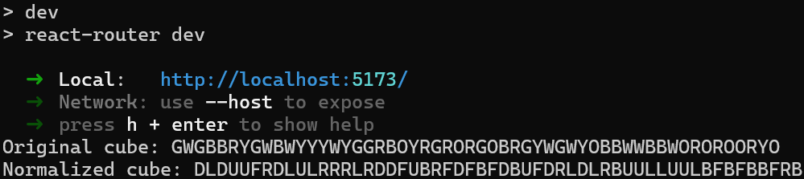
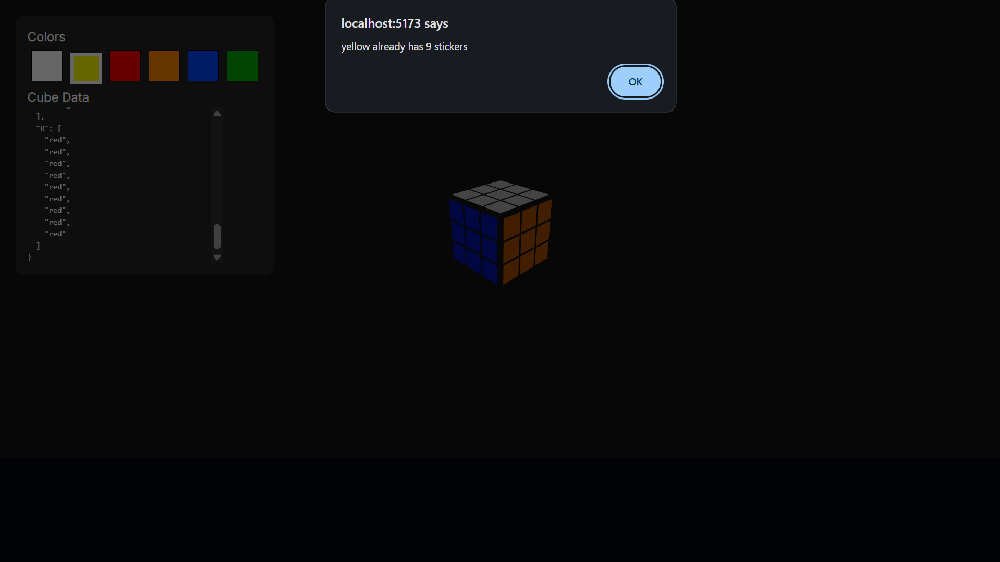
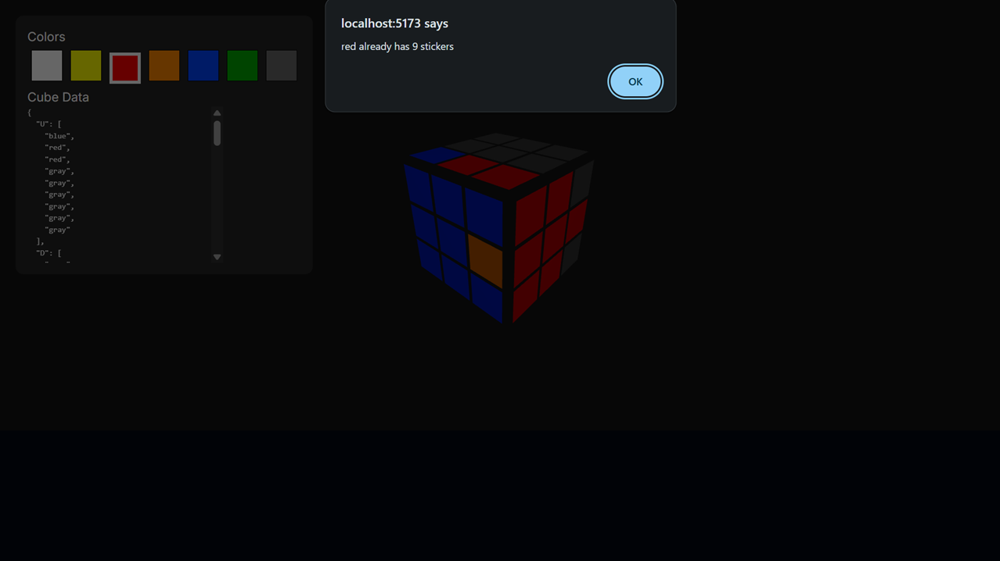
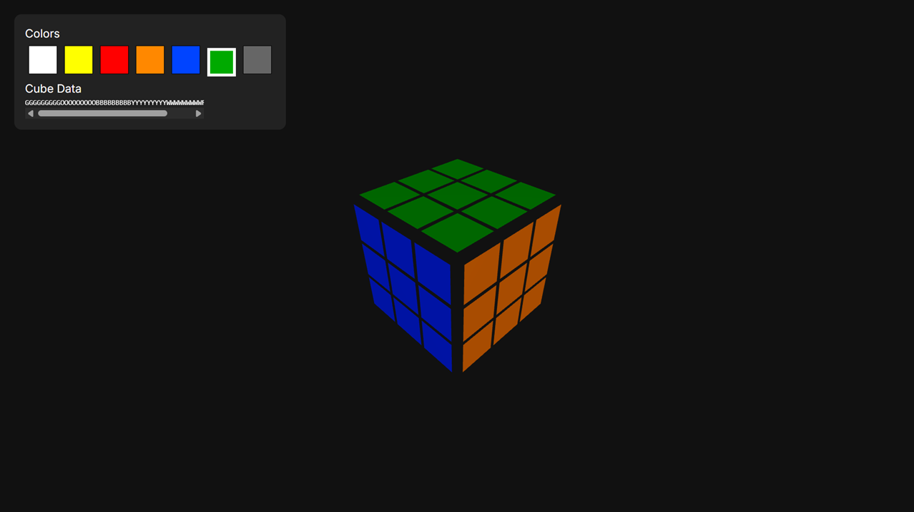
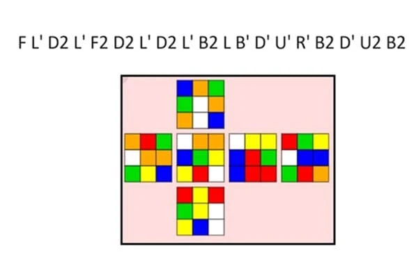

# RUbit's
Rubik's cubing sidekick
> Corner and quarter turns | Pulling, playing, and plying off flying colours

# Set Up Your Environment Code Invigoratingly
In a .env file, put the following followed by the API Key generated under the + New Key button/widget in OpenRouter's documentation or dashboard after onboarding with intial credentials:
OPENROUTER_API_KEY=sk-or-v1-examplerandomhashwithcharactersanddigits8e8e8e8e8e8e8e8e8e8e8e8e8e8e7e7e7e7e7e7e7e7e7e7e7e7e9e9e9e9e9e9e9e9e9e9e9e9e9e9ee99eahosdjbfasbdfa9yf0asdifhasd9yfq4

In a cmd terminal on Windows or bash on Linux or Terminal/Shell anywhere like Mac or TempleOS who knows; it's all good for something whatever it may be, type in the syntax npm run dev and press enter on your keyboard to send it through to the system machine in a systematic manner and practical method.

Click Open Cube Editor and a customary large language model utilising its training with natural language processing and neutral neural networks which can only be seen server-side end of things.

Format the cube with the physical orientations and state of the physical item that you may or may not own but will soon get two
if you become fascinated by the many facets of different cube configurations and ways to make it how said item was when it first came in its see-through packaging.

Press Solve and wait for a response from the pertaining training model

Once finished, solve the cube following the instructions outputed onto the UI and augment the overall UX with CI/CD implications I guess.

Examples of processes to take include but are not nearly limited to:
Kociemba, CFOP, ZBLL, and differing parities when concerning the groupings of same color panels.

For faster solving times, consider optimizing the wide range of waypaths that you may take to arrive at a completed puzzle formation. For more information, see official handbooks for both handy and restrictive methodologies to have fun with an age-old yet timeless creation!